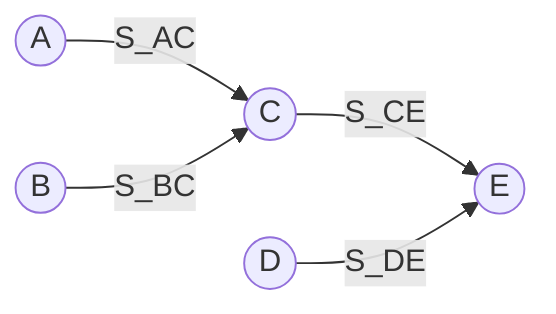

# 实现前驱关系

> 同步：【先 V 后 P】，而且 V 操作和 P 操作一般分属两个进程  
> 对于同一个信号量 S，只有进程 A 执行 V(S)，进程 B 才能执行 P(S)

## 问题描述

现有 5 个操作 A、B、C、D 和 E，操作 C 必须在 A 和 B 完成后执行，操作 E 必须在 C 和 D 完成后执行。  
请使用信号量的`wait()`、`signal()`操作（P、V 操作）描述上述操作之间的同步关系，并说明所用信号量及其初值。



## `AOV`网

> `AOV` 网每一个顶点代表一个任务，每一条有向边代表一个同步关系，对于任意一条边 (u,v) ， u 必须在 v 之前完成。  
> **分析每一个顶点所代表的任务、该顶点的入边（该任务的前置任务）表示的同步关系以及该顶点的出边（该任务的后序任务）表示的同步关系。**  
> 为了方便，可以先对 `AOV` 网进行拓扑排序，按照拓扑排序序列顺序依次对每个任务进行分析。

## 实现过程

```cpp
semaphore S_AC = 0;    // 控制操作A和C的执行顺序
semaphore S_BC = 0;    // 控制操作B和C的执行顺序
semaphore S_CE = 0;    // 控制操作C和E的执行顺序
semaphore S_DE = 0;    // 控制操作D和E的执行顺序

cobegin
A() {
    完成操作A;
    V(S_AC);
}

B() {
    完成操作B;
    V(S_BC);
}

C() {
    P(S_AC);
    P(S_BC);
    完成操作C;
    V(S_CE);
}

D() {
    完成操作D;
    V(S_DE);
}

E() {
    P(S_CE);
    P(S_DE);
    完成操作E;
}
coend
```
