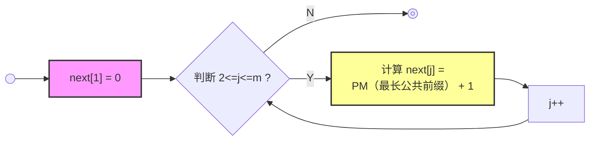
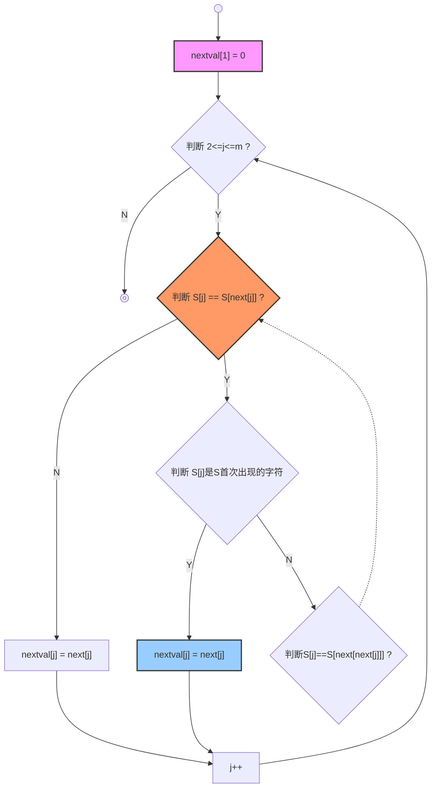
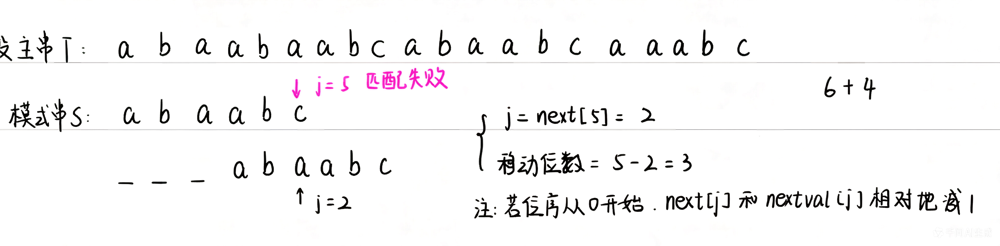

# 串

> 以模式串 **abcaabbabcab** 为例

## 求 next 和 nextval 数组

- next

=> next[2] = 1

- nextval

| j          | 1   | 2   | 3   | 4   | 5   | 6   | 7   | 8   | 9   | 10  | 11  | 12  |
| :--------- | :-- | :-- | :-- | :-- | :-- | :-- | :-- | :-- | :-- | :-- | :-- | :-- |
| S[j]       | a   | b   | c   | a   | a   | b   | b   | a   | b   | c   | a   | b   |
| next[j]    | 0   | 1   | 1   | 1   | 2   | 2   | 3   | 1   | 2   | 3   | 4   | 5   |
| nextval[j] | 0   | 1   | 1   | 0   | 2   | 1   | 3   | 0   | 1   | 1   | 0   | 5   |

## BF && KMP

- BF
  i = i - j + 2, j = 1
  时间复杂度： 最坏 O(m\*n)；最好平均 O(m+n)

- KMP
  主串不回溯；j = next[j]
  时间复杂度： O(m+n)
  移动位数 = j - next[j] = j - nextval[j] = 已匹配的字符 - PM

## 匹配过程中字符比较次数

