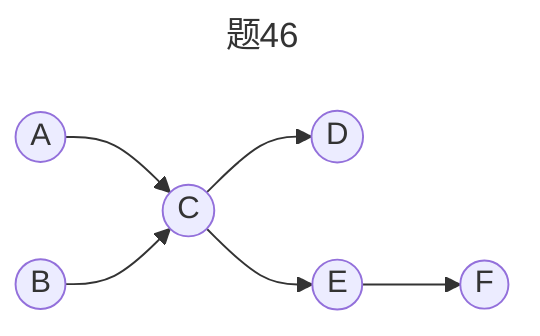

## 2022 408真题解答

- **问题描述**

```text [2022·408真题]
某进程的两个线程 T1 和 T2 并发执行 A、B、C、D、E 和 F 共 6 个操作，其中 T1 执行 A、E 和 F ，T2 执行 B、C 和 D。
题图46表示上述 6 个操作的执行顺序所必须满足的约束：C 在 A 和 B 完成后执行， D 和 E 在 C 完成后执行，F 在 E 完成后执行，
请使用信号量 wait()、signal() 操作描述 T1 和 T2 之间的同步关系，并说明所用信号量的作用及其初值。
```



- **解答过程**

> 只有不同进程之间的操作才需要进行同步
> 分析哪些操作必须在另一个进程的某个操作完成后执行
> 确定同步关系，先 V 后 P
> - 对于 `T1`，E 必须在 `T2` 执行完 C 后才能执行
> - 对于 `T2`，C 必须在 `T1` 执行完 A 后才能执行


**伪代码**

```cpp
semaphore S_AC = 0;       // 控制操作A和C的执行顺序
semaphore S_CE = 0;       // 控制操作C和E的执行顺序

cobegin
T1(){
    执行A;
    signal(S_AC);
    wait(S_CE);
    执行E;
    执行F;
}

T2(){
    执行B;
    wait(S_AC);
    执行C;
    signal(S_CE);
    执行D;
}
coend
```