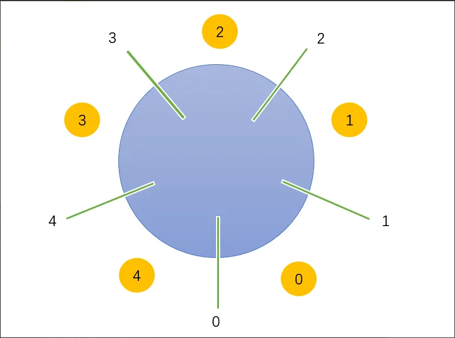

# 哲学家进餐问题 (The Dinning Philosophers Problem)

## 问题描述

一张圆桌，五个哲学家，五支筷子（每两个哲学家中间会有一支筷子），哲学家要么思考，要么吃饭。  
吃饭前会拿起左右两边的筷子，吃饭后会放下筷子。如果筷子被其它哲学家拿走，则自己需要等待。

## 分析步骤

- 五个哲学家对应了五个进程，然后在同一个时间段内，对于同一支筷子，只能有一个哲学家去使用它，所以筷子是一种临界资源，我们用互斥信号量 chopstick = 1 表示。
- 鉴于这里有五支筷子，所以我们准备一个互斥信号量数组 chopstick[5] = {1,1,1,1,1}。
- 另外，由于任何一个哲学家都只可能拿离自己最近的左右筷子，所以为了加以区分，我们需要给哲学家和筷子进行编号。对于哲学家，从 0 到 4 进行编号，
由于哲学家按照圆桌首尾连接，所以某个哲学家左右两边的筷子编号与自己本身的编号相关。
- 以哲学家 i 为例，它左边的筷子编号是 i。右边则是 (i+1)%5，如下图所示：

{width=50% max-width=600px}

## 解决方案

### 实现原子操作

- **使用一个互斥信号量`mutex`,使拿筷操作一气呵成**

破坏【请求并保持条件】

```cpp
semaphore chopstick[5] = {1, 1, 1, 1, 1};           // 互斥信号量，确保对筷子操作的互斥，初始值为1
semaphore mutex = 1;                                // 互斥信号量，确保对同时拿起左右筷子操作的互斥，初始值为1

cobegin
Pi() {
    while(1){           
        P(mutex);                                   // 互斥量减1，进入临界区
        P(chopstick[i]);                            // 拿起左边筷子       
        P(chopstick[(i + 1) % 5]);                  // 拿起右边筷子
        V(mutex);                                   // 互斥量加1，退出临界区
        eat;
        V(chopstick[i]);
        V(chopstick[(i + 1) % 5]);
        think;
    }
}
coend
```

- **AND 信号量集机制**

```cpp
semaphore chopstick[5] = {1, 1, 1, 1, 1};               // 互斥信号量，确保对筷子操作的互斥，初始值为1

cobegin
Pi() {
    while(1){
        Swait(chopstick[i],chopstick[(i + 1) % 5]);     // 同时拿起左边和右边的筷子
        eat;
        Ssingal(chopstick[i],chopstick[(i + 1) % 5]);   // 同时放下左边和右边的筷子
        think;
    }
}
coend
```

### 限制同时就餐的哲学家数量

破坏【循环等待条件】

```cpp
semaphore chopstick[5] = {1, 1, 1, 1, 1};       // 互斥信号量，确保对筷子操作的互斥，初始值为1
semaphore seat = 4;                             // 同步信号量，表示同时就餐的哲学家数量，初始值为4

cobegin
pi() {
    while(1) {
        P(seat);                                // 允许一位哲学家就餐
        P(chopstick[i]);                        // 拿起左边筷子
        P(chopstick[(i + 1) % 5]);              // 拿起右边筷子
        eat;
        V(chopstick[i]);                        // 放下左边筷子
        V(chopstick[(i + 1) % 5]);              // 放下右边筷子
        V(seat);                                // 允许下一位哲学家就餐
        think;
    }
}
coend
```

### 奇数拿左边，偶数拿右边

破坏【循环等待条件】

```cpp
semaphore chopstick[5] = {1, 1, 1, 1, 1};            // 互斥信号量，确保对筷子操作的互斥，初始值为1

cobegin
Pi() {
    while(1) {
        if (i % 2 == 0) {                            // 偶数哲学家：先右后左
            P(chopstick[(i + 1) % 5]);
            P(chopstick[i]);
            eat();
            V(chopstick[(i + 1) % 5]);
            V(chopstick[i]);
        } else {                                     // 奇数哲学家：先左后右
            P(chopstick[i]);
            P(chopstick[(i + 1) % 5]);
            eat();
            V(chopstick[i]);
            V(chopstick[(i + 1) % 5]);
        }
    }
}
coend
```

| 哲学家 i | 左手筷子 | 右手筷子 | 拿筷子顺序 |
|----------|----------|----------|------------|
| 0（偶）   | 0        | 1        | 先拿 1（右），再拿 0（左） |
| 1（奇）   | 1        | 2        | 先拿 1（左），再拿 2（右） |
| 2（偶）   | 2        | 3        | 先拿 3（右），再拿 2（左） |
| 3（奇）   | 3        | 4        | 先拿 3（左），再拿 4（右） |
| 4（偶）   | 4        | 0        | 先拿 0（右），再拿 4（左） |
